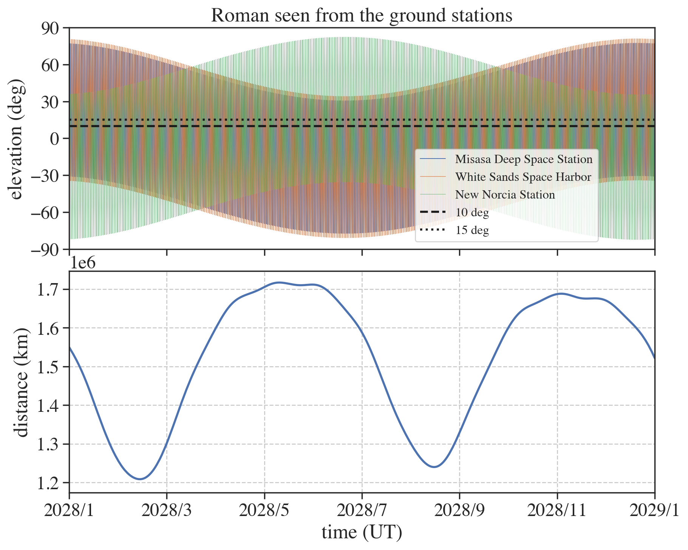
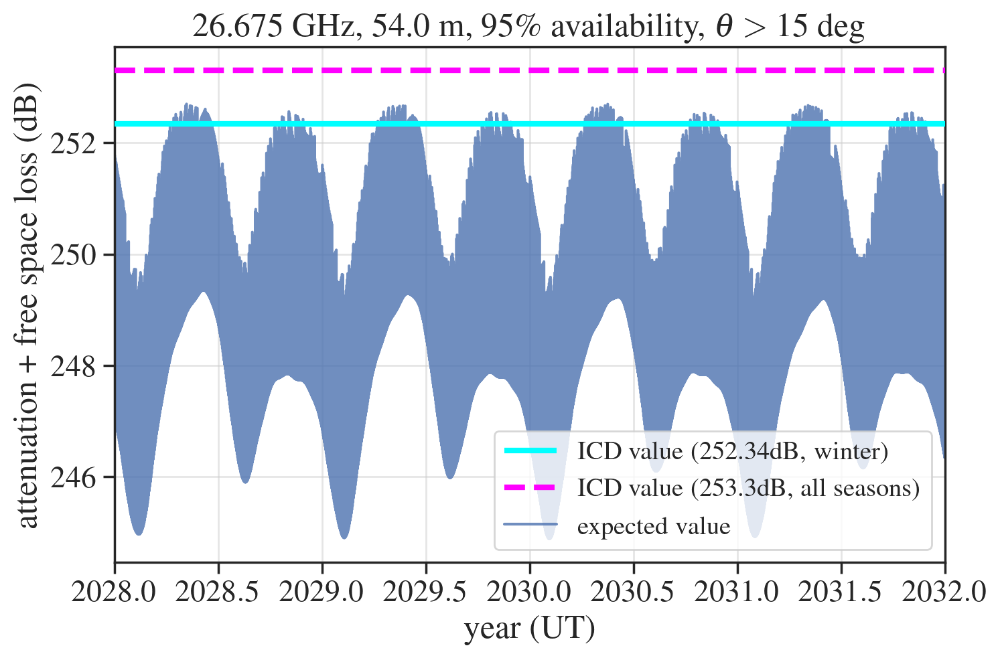

# ground\_vis

[](https://www.python.org/)


**ground\_vis** is a lightweight toolkit for evaluating line‑of‑sight visibility and Ka‑band link budgets for deep‑space spacecraft from selected ground stations. It was written for the *Roman Space Telescope* but can be adapted to any mission with an OEM ephemeris.

---

## Features

* **Visibility analysis** – Parse OEM orbit ephemerides and compute elevation, range, and slant angle as seen from Misasa (Japan), White Sands (USA), and New Norcia (Australia) at an arbitrary cadence (default 10 min).
* **Ka‑band link budget** – Combine free‑space loss with gaseous absorption, rain fade, cloud attenuation, and scintillation loss using the ITU‑R P.618 model implemented in the `itur` package.
* **Automated plotting** – Produce production‑ready PNG figures (elevation profiles, monthly visibility histograms, frequency‑dependent attenuation curves, …).

## Repository layout

```text
ground_vis/
├── code/
│   ├── 1_make_data.py      # OEM → visibility tables
│   └── 2_make_plots.py     # ITU‑R attenuation & plots
├── plots/                  # Sample output
│   ├── elevation_roman.png
│   └── attenuation_each_site.png
└── README.md
```

## Requirements

| Package                                  | Tested version |
| ---------------------------------------- | -------------- |
| Python                                   | ≥ 3.9          |
| numpy, pandas, scipy                     | latest         |
| matplotlib, seaborn                      | latest         |
| astropy                                  | ≥ 6.0          |
| [`oem`](https://pypi.org/project/oem/)   | ≥ 0.4          |
| [`itur`](https://pypi.org/project/itur/) | ≥ 0.5          |

Install everything with:

```bash
pip install numpy pandas scipy matplotlib seaborn astropy oem itur
```

## Quick start

1. **Prepare data**
   Place the Roman OEM file (e.g. `RST_EPH_PRED_LONG_*.oem`) under `data/` and adjust the file path in `code/1_make_data.py` if necessary.

2. **Generate visibility tables**

   ```bash
   python code/1_make_data.py
   ```

   This creates `data/Roman_time_alt_distance.npy` and elevation plots in `plots/`.

3. **Compute link budgets & plots**

   ```bash
   python code/2_make_plots.py
   ```

   Additional figures such as `att_FSL_misasa_year.png` will appear in `plots/`.

## Example output

| Elevation profile                       | Annual Ka‑band attenuation (Misasa)           |
| --------------------------------------- | --------------------------------------------- |
|  |  |

## FAQ

* **Can I analyse other ground stations or frequencies?**
  Absolutely – edit `lat_GS`, `lon_GS`, antenna diameter `D`, operating frequency `f`, and availability percentage `p` in `code/2_make_plots.py`.

* **Do you support trajectory files other than OEM?**
  The parser in `code/1_make_data.py` can be adapted to CDF/SPICE/CSV ephemerides with minimal changes.

## Roadmap

* Automatic link‑margin calculation
* Monte‑Carlo rain‑rate sampling
* Command‑line interface & Sphinx documentation

## License

This project is licensed under the [MIT License](./LICENSE).

## Acknowledgements

* NASA Flight Dynamics Facility (FDF) for OEM data
* ITU‑R Working Party 3M for Recommendation P.618
* The Astropy Project
* Developed by **Shota Miyazaki (ISAS/JAXA)** – issues and PRs are welcome! ✨

